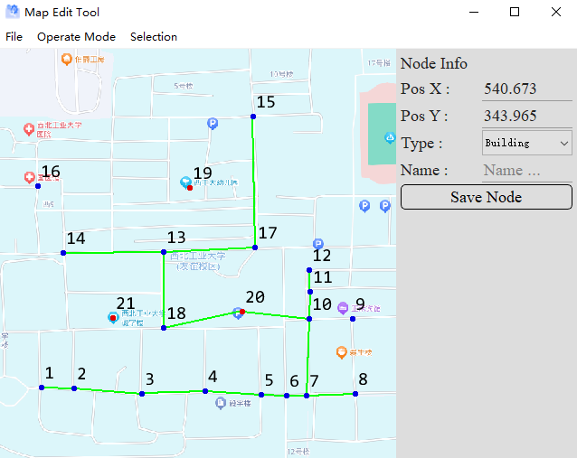

Map Edit Tool
===================
---
> C++ / Qt5 项目

二维地图编辑器项目。能够在地图图片中创建路标点，创建道路，支持较少的批量编辑操作。

## 需求分析
- 支持导入地图背景图片
- 支持通过点击、拓拽的方式插入地图点、地图边
- 支持地图点、边的批量编辑
- 支持地图数据整体的打包导出和导入

## 使用效果

## 关于作者
 
参考[B站视频](https://www.bilibili.com/video/BV1kM411K7Jr/?spm_id_from=333.788.recommend_more_video.1&vd_source=e07ba382c7723740f058bd78a2e85fe7)中的作品，经过修改后发布。本作品的主要目的是做个小练习。